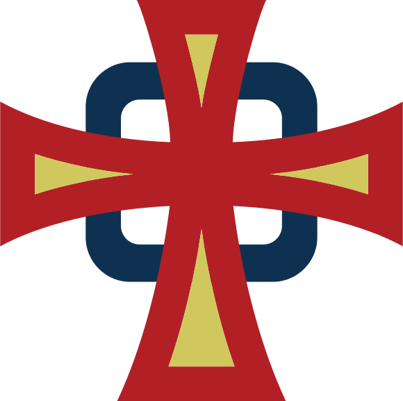

# 天主教中華基督神修小會網站 (CCSC Website)

<div align="center">
  
  <h3>
    天主教中華基督神修小會<br>
    Chinese Christian Spirit Community
  </h3>
</div>

## 📝 專案介紹

這是天主教中華基督神修小會的官方網站應用，使用Streamlit框架開發。本網站旨在提供關於小會的信息、活動和服務，並促進社區交流與聯繫。

## ✨ 功能特色

- **首頁**: 組織基本信息、聯繫方式
- **關於我們**: 
  - 小會介紹
  - 宗旨與精神
  - 歷史沿革
  - 大事年表
- **活動**: 最新活動公告和台北分會特別活動
- **服務與生活**: 展示小會的服務項目和文化福傳
- **行事曆**: 
  - 小會活動行事曆
  - 分會行事曆
- **出版品**: 提供「心泉」等出版物信息
- **搜尋**: 網站內容搜尋功能

## 🛠️ 技術架構

- **前端框架**: Streamlit (v1.42.0)
- **程式語言**: Python
- **環境配置**: python-dotenv (v1.0.1)
- **視覺設計**: HTML/CSS (Streamlit自定義組件)
- **頁面管理**: 統一的頁面初始化系統，包含自動標題設置和導航

## 📦 安裝指南

1. 克隆此儲存庫

   ```bash
   git clone [repository-url]
   cd CCSC
   ```

2. 安裝所需套件

   ```bash
   pip install -r requirements.txt
   ```

3. 創建環境變數檔案(可選)

   ```bash
   # .env 檔案
   dev=false
   ```

## 🚀 使用說明

啟動應用程式:

```bash
streamlit run main.py
```

應用程式將在本地端啟動，通常在 http://localhost:8501

## 📂 專案結構

```
CCSC/
│
├── main.py                 # 主入口文件
├── requirements.txt        # 依賴套件
│
├── pages/                  # 網站各頁面
│   ├── about_us.py        # 關於我們
│   ├── activities.py      # 活動
│   ├── calendar.py        # 行事曆
│   ├── calendar_branch.py # 分會行事曆
│   ├── culture_spread.py  # 文化福傳
│   ├── history_ccsc.py    # 小會歷史
│   ├── publications.py    # 出版品
│   ├── search.py         # 搜尋
│   ├── serviceslife.py   # 服務與生活
│   ├── taipei_branch.py   # 台北分會
│   ├── timeline_ccsc.py   # 小會時間軸
│   ├── vision_ccsc.py    # 小會願景
│   ├── wellspring_of_the_soul.py  # 心泉
│   └── what_is_ccsc.py   # 小會介紹
│
├── static/                # 靜態資源
│   └── images/           # 圖片資源
│       ├── banner.jpg    # 橫幅圖片
│       ├── logo.png      # 組織標誌
│       ├── logo.svg      # 向量格式標誌
│       └── 背景素材.jpg   # 背景圖片
│
└── utils/                # 工具函數
    ├── __init__.py      # 套件初始化
    ├── menu.py          # 導航菜單管理
    └── utils.py         # 通用工具和頁面初始化

## 🔄 更新日誌

### 2025-04-11
- 統一頁面初始化邏輯
- 優化頁面標題管理
- 新增頁面特定配置支援

如需更多資訊，請訪問我們的網站或聯繫我們。
